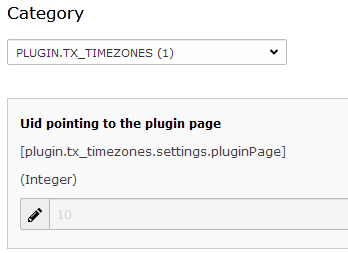

.. ==================================================
.. FOR YOUR INFORMATION
.. --------------------------------------------------
.. -*- coding: utf-8 -*- with BOM.

.. ==================================================
.. DEFINE SOME TEXTROLES
.. --------------------------------------------------
.. role::   underline
.. role::   typoscript(code)
.. role::   ts(typoscript)
   :class:  typoscript
.. role::   php(code)
.. highlight:: php

.. _admin-manual:

Administrator Manual
====================

Target group: **Administrators**

.. _admin-installation:

Installation
------------

To install the extension, perform the following steps:

#. Check that the php module *intl* is activated
	You may place a tiny phpinfo.php on the diretory of your website:

	.. code-block:: php

		<?php
			ini_set('display_errors','on');
			phpinfo();
		?>

   You should look for a section similar to the following: 

   .. figure:: ../Images/PhpInfoIntlModule.png
      :alt: PHPINFO Section identifying installed module 

   If you find that the extension is *NOT* installed please check http://php.net/manual/de/intl.installation.php for installation options. 

#. Go to the Extension Manager
#. Install the extension
#. Load the static template
#. Include the pre-defined COA in either of the following ways on **every** page where timezone calculation should take place
	#. Typoscript with the predefined COA object :typoscript:`lib.timezone`
	#. Fluid template:

		.. code-block:: html

			<f:cObject typoscriptObjectPath="lib.timezone" />

	The COA will generate a hyperlink to the page set in the configuration:

	.. figure:: ../Images/IndexTimezone.png
		:alt: Link showing current timezone

	.. important::

		Place timezone link on every page to activate time calculation

.. _admin-configuration:

Configuration
-------------

The only configuration is pointing to the correct page that contains the
extensions content element to change the timezone.

   Constant uid setting pointing to the the page for changing the timezone.

.. _admin-faq:

FAQ
---

No FAQ so far