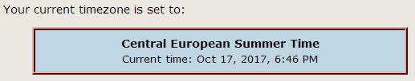
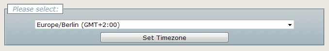

.. ==================================================
.. FOR YOUR INFORMATION
.. --------------------------------------------------
.. -*- coding: utf-8 -*- with BOM.

.. ==================================================
.. DEFINE SOME TEXTROLES
.. --------------------------------------------------
.. role::   underline
.. role::   typoscript(code)
.. role::   ts(typoscript)
   :class:  typoscript
.. role::   php(code)
.. highlight:: php

.. _introduction:

Introduction
============

.. _what-it-does:

What does it do?
----------------

This extension enables website designers to take care of user's timezones.
It formats dates and times according to current website reader's preferences.
Furthermore, it provides a frontend plugin that enables website users to set
their preferred timezone.

Version 2.0.0 is a complete refactoring of the original extension by
Ralph Schuster. It depends on that the php module *intl* is activated in the
server configuration.

.. _screenshots:

Screenshots
-----------

The following screenshots may give you a short glimpse on how the extension
will be visible on the screen as per default. You may adjust everthing as
you like.

    Place timezone link on every page to activate time calculation

    Content element to display current timezone information

    Content element to change current timezone
