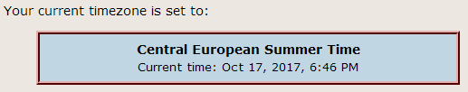

.. ==================================================
.. FOR YOUR INFORMATION
.. --------------------------------------------------
.. -*- coding: utf-8 -*- with BOM.

.. ==================================================
.. DEFINE SOME TEXTROLES
.. --------------------------------------------------
.. role::   underline
.. role::   typoscript(code)
.. role::   ts(typoscript)
   :class:  typoscript
.. role::   php(code)
.. highlight:: php

.. _user-manual:

Users Manual
============

Target group: **Editors**

The extension provides three content elements that could be included on a page.
The following basic steps should be common for you as an editor:

#. Insert a new content element choosing type *Insert plugin*

	.. figure:: ../Images/EditorBEInsertPlugin.png
		:alt: Content element type "Insert plugin"

		Content element type "Insert plugin"

#. On the tab *Plugin* - select the plugin named "Timezones"

	.. figure:: ../Images/EditorBESelectTimezones.png
		:alt: Choose plugin "Timezones"

		*Timezones* plugin selection

Link showing current timezone
-----------------------------

.. important::

   Best practise woul be if the administrator placed this content element
   onto the common template using the provided library. You editor should
   not really take notice of this part. Without having this content element
   placed on a page timezone calculation will not function properly.

Example rendered in frontend
++++++++++++++++++++++++++++

.. figure:: ../Images/IndexTimezone.png
	:alt: Link showing current timezone

	Place timezone link on every page to activate time calculation

How to get it from editor view in backend
+++++++++++++++++++++++++++++++++++++++++

Show current timezone
-----------------------------

Example rendered in frontend
++++++++++++++++++++++++++++

How to get it from editor view in backend
+++++++++++++++++++++++++++++++++++++++++

Choose a new timezone
-----------------------------

Example rendered in frontend
++++++++++++++++++++++++++++

.. figure:: ../Images/SelectTimezone.png
	:alt: Select new timezone

How to get it from editor view in backend
+++++++++++++++++++++++++++++++++++++++++

.. figure:: ../Images/EditorBESelectSelectPlugin.png
	:alt: Backend plugin selection

.. _user-faq:

FAQ
---

#. Do I still need to use the central function :php:`tx_timezones_pi1::formatDate($format, $tstamp);` in my extension?
	No you don't have to use this function anymore. It is still provided as a
	dummy function the will return the same date which it is given as a parameter.
	The timezone calculation is now session managed of PHP and the intl module.